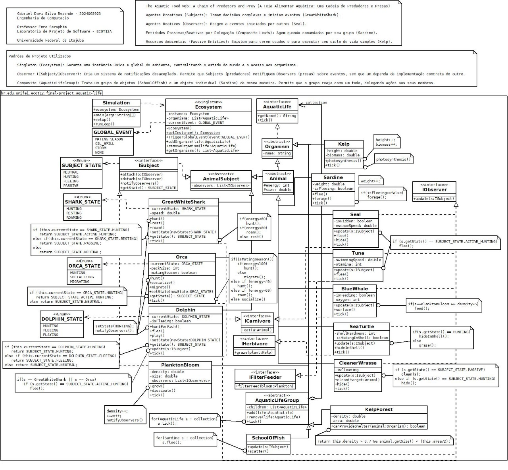

# The Aquatic Food Web: A Chain of Predators and Prey
## (A Teia Alimentar Aquática: Uma Cadeia de Predadores e Presas)

**Autor:** Gabriel Davi Silva Resende - 2024003923  
**Curso:** Engenharia de Computação  
**Professor:** Enzo Seraphim  
**Disciplina:** Laboratório de Projeto de Software - ECOT12A  
**Instituição:** Universidade Federal de Itajubá

---

## 📖 Tema do Trabalho

**Água (Mar, Rio e Lagos): Comportamento de animais que vivem nos mares, rios e lagos**

Este projeto simula o comportamento de animais aquáticos em um ecossistema marinho, modelando interações entre predadores e presas, eventos globais do ambiente e ciclos de vida de organismos aquáticos.

---

## 🎯 Objetivos do Projeto

- **Modelo UML (Dia):** Diagrama com 20 classes utilizando 2 padrões de projeto
- **Implementação Maven:** Projeto Java implementando o modelo UML
- **Aplicação de Simulação:** Instancia e demonstra os comportamentos das 20 classes

---

## 📊 Diagrama UML

O diagrama UML completo pode ser visualizado no arquivo `diagram.jpg`:



O arquivo fonte do diagrama está em `vida-aquatica.uml` (formato Dia).

---

## 🏗️ Padrões de Projeto Utilizados

### 1. Singleton (Ecosystem)
Garante uma instância única e global do ambiente, centralizando o estado do mundo e o acesso aos organismos.

```java
public final class Ecosystem {
    private static Ecosystem instance;
    public static Ecosystem getInstance() {
        if (instance == null) {
            instance = new Ecosystem();
        }
        return instance;
    }
}
```

### 2. Observer (ISubject/IObserver)
Cria um sistema de notificações desacoplado. Permite que Subjects (predadores) notifiquem Observers (presas) sobre eventos, sem que um dependa da implementação concreta do outro.

- **Subjects (Predadores/Proativos):** GreatWhiteShark, Orca, Dolphin, PlanktonBloom
- **Observers (Presas/Reativos):** Seal, Tuna, SchoolOfFish, BlueWhale, SeaTurtle, CleanerWrasse

### 3. Composite (AquaticLifeGroup)
Trata um grupo de objetos (SchoolOfFish) e um objeto individual (Sardine) da mesma maneira. Permite que o grupo reaja como um todo, delegando ações aos seus membros.

```java
public abstract class AquaticLifeGroup implements AquaticLife {
    private List<AquaticLife> children = new ArrayList<>();
    public void tick() {
        for(AquaticLife a : children) {
            a.tick();
        }
    }
}
```

---

## 📦 Estrutura das 20 Classes

### Interfaces
| Classe | Descrição |
|--------|-----------|
| `AquaticLife` | Interface base para toda vida aquática |
| `ISubject` | Interface do padrão Observer (sujeito observável) |
| `IObserver` | Interface do padrão Observer (observador) |
| `ICarnivore` | Interface para animais carnívoros |
| `IHerbivore` | Interface para animais herbívoros |
| `IFilterFeeder` | Interface para animais filtradores |

### Classes Abstratas
| Classe | Descrição |
|--------|-----------|
| `Organism` | Classe base para organismos |
| `Animal` | Classe abstrata para animais (energia, tamanho) |
| `AnimalSubject` | Animal que é um Subject no padrão Observer |
| `AquaticLifeGroup` | Grupo de vida aquática (padrão Composite) |

### Agentes Proativos (Subjects/Predadores)
| Classe | Descrição |
|--------|-----------|
| `GreatWhiteShark` | Tubarão branco - predador principal |
| `Orca` | Orca - predador social em grupo |
| `Dolphin` | Golfinho - predador que também é presa |
| `PlanktonBloom` | Floração de plâncton - notifica filtradores |

### Agentes Reativos (Observers/Presas)
| Classe | Descrição |
|--------|-----------|
| `Seal` | Foca - reage a predadores |
| `Tuna` | Atum - presa com alta velocidade |
| `Sardine` | Sardinha - membro de cardume |
| `SchoolOfFish` | Cardume - grupo de sardinhas (Composite) |
| `BlueWhale` | Baleia azul - filtrador de plâncton |
| `SeaTurtle` | Tartaruga marinha - herbívoro/onívoro |
| `CleanerWrasse` | Bodião limpador - limpa outros animais |

### Recursos Ambientais
| Classe | Descrição |
|--------|-----------|
| `Kelp` | Alga kelp - produtor primário |
| `KelpForest` | Floresta de kelp - habitat (Composite) |

### Infraestrutura
| Classe | Descrição |
|--------|-----------|
| `Ecosystem` | Ecossistema global (Singleton) |
| `Simulation` | Aplicação principal de simulação |

### Enumerações
| Enum | Descrição |
|------|-----------|
| `GLOBAL_EVENT` | Eventos globais (MATING_SEASON, OIL_SPILL, STORM, NONE) |
| `SUBJECT_STATE` | Estado dos subjects (NEUTRAL, HUNTING, FLEEING, PASSIVE) |

---

## 🛠️ Tecnologias

- **Linguagem:** Java 17
- **Build:** Apache Maven
- **UML:** Dia Diagram Editor

---

## 🚀 Como Executar

### Pré-requisitos
- Java JDK 17 ou superior
- Apache Maven 3.6+

### Compilar o Projeto
```bash
cd aquatic_food_web
mvn compile
```

### Executar a Simulação
```bash
cd aquatic_food_web
mvn exec:java -Dexec.mainClass="br.edu.unifei.ecot12.final_project.aquatic_life.Simulation"
```

Ou compile e execute manualmente:
```bash
cd aquatic_food_web
mvn compile
java -cp target/classes br.edu.unifei.ecot12.final_project.aquatic_life.Simulation
```

---

## 🎮 Comportamentos Simulados

### Ciclo de Vida dos Animais
Cada animal possui um método `tick()` que é executado a cada ciclo da simulação, determinando seu comportamento baseado em:
- **Energia:** Animais com baixa energia caçam ou buscam comida
- **Estado:** HUNTING, FLEEING, RESTING, ROAMING, etc.

### Eventos Globais
A simulação dispara eventos que afetam todo o ecossistema:
- **MATING_SEASON:** Época de acasalamento - afeta comportamento das orcas
- **STORM:** Tempestade - afeta todos os organismos
- **OIL_SPILL:** Derramamento de óleo (implementável)

### Interações Predador-Presa
1. Quando um tubarão caça (`hunt()`), ele notifica seus observadores
2. Presas como focas e atuns reagem (`update()`) e fogem (`flee()`)
3. O cardume de sardinhas se dispersa (`scatter()`)

---

## 📁 Estrutura do Projeto

```
aquatic_food_web/
├── README.md
├── diagram.jpg              # Diagrama UML em imagem
├── vida-aquatica.uml        # Arquivo fonte UML (Dia)
└── aquatic_food_web/
    ├── pom.xml              # Configuração Maven
    └── src/
        └── main/
            └── java/
                └── br/edu/unifei/ecot12/final_project/aquatic_life/
                    ├── Simulation.java      # Ponto de entrada
                    ├── Ecosystem.java       # Singleton
                    ├── AquaticLife.java     # Interface base
                    ├── ISubject.java        # Observer pattern
                    ├── IObserver.java       # Observer pattern
                    ├── AquaticLifeGroup.java # Composite pattern
                    └── ... (outras classes)
```

---

## 📝 Licença

Projeto acadêmico desenvolvido para a disciplina ECOT12A - Laboratório de Projeto de Software na UNIFEI.
